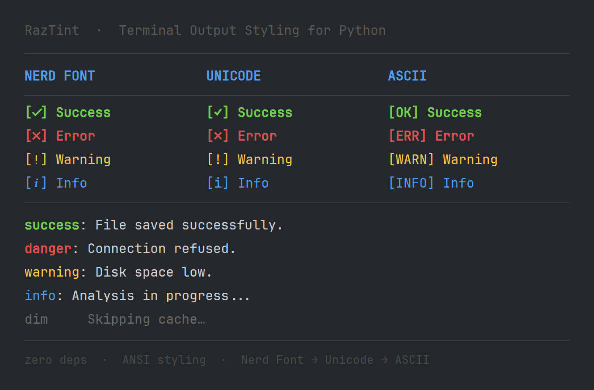

<div align="center">
  
  <br><br>
  
[](https://pypi.org/project/raztint/)
[](https://github.com/razbuild/raztint)
[](https://codecov.io/gh/razbuild/raztint)

[](https://pypi.org/project/raztint/)
[](https://pepy.tech/project/raztint)

  <p>A zero-dependency Python library for ANSI coloring and smart CLI icons that automatically adapt to your environment.</p>
</div>

## Preview

<p align="center">
  
</p>

---

## Table of Contents

- [Preview](#preview)
- [Why RazTint?](#why-raztint)
- [Features](#features)
- [Requirements](#requirements)
- [Installation](#installation)
- [Quick Start](#quick-start)
- [Documentation](#documentation)
- [Extended Colors](#extended-colors)
- [Known Limitations](#known-limitations)
- [Contributing](#contributing)
- [License](#license)

---

## Why RazTint?

> [!NOTE]
> RazTint believes terminal styling should be *zero-friction*: no dependencies, no configuration files, no guessing the user's environment. It figures out the rest so you can focus on your CLI logic.

- **Zero dependencies** — Python ≥ 3.10 standard library only
- **Smart icons** — Nerd Font → Unicode → ASCII fallback, with environment-aware detection
- **Cross-platform behavior** — Linux, macOS, and Windows, including CI
- **Minimal setup** — import and use; detection is cached and fast

---

## Features

- 🎨 Full ANSI 16-color foreground and background support
- 🌈 Extended colors: 24-bit True Color (`rgb`, `hex_color`) and 256-color (`color256`)
- ✨ Text styles: bold, dim, italic, underline, strikethrough
- 🔍 Status icons with three-tier fallback and environment-aware detection
- 🖌️ **`paint()`** — one call for color, background, styles, and icons
- 🎯 **Intents** — semantic presets (`success`, `danger`, `warning`, …)
- 🔒 **Redaction** — mask secrets in logs before printing
- 💡 Fully type-hinted public API (`py.typed`, IDE autocompletion)
- ⚙️ Configurable via environment variables (`NO_COLOR`, `RAZTINT_FORCE_COLOR`, …)

---

## Requirements

- Python 3.10 or newer

---

## Installation

```bash
pip install raztint
```

From source:

```bash
git clone https://github.com/razbuild/raztint.git
cd raztint
uv sync
```

---

## Quick Start

```python
from raztint import ok, paint

print(f"{ok()} File saved.")
print(paint("Connection failed.", color="red", icon="err"))

# Semantic intents
print(paint("Deployment complete.", intent="success"))

# Mask secrets before logging
print(paint("password=1234", intent="debug", redact=True))  # password=****
```

Standalone redaction without formatting:

```python
from raztint import redact

print(redact("password=supersecret api_key=ghp_abc123"))
# password=**** api_key=****
```

See [Getting Started](docs/getting-started.md) for more examples. Icon output depends on the detected mode: Nerd Font, standard Unicode, or ASCII.

---

## Documentation

| Guide | Description |
|---|---|
| [Getting Started](docs/getting-started.md) | Functional usage, `paint()`, and the `tint` instance |
| [API Reference](docs/api-reference.md) | Colors, styles, icons, and `RazTint` class methods |
| [Intents](docs/intents.md) | Semantic presets for common CLI messages |
| [Security & Redaction](docs/redaction.md) | Masking tokens, credentials, and custom rules |
| [Icons & Detection](docs/icons-and-detection.md) | Icon modes and environment/font/color detection logic |
| [Configuration](docs/configuration.md) | Environment variables and runtime toggles |
| [Development](docs/development.md) | Local setup, tests, and linting |
| [Tutorial](docs/tutorial.md) | Philosophy, detection walk-through, and best practices |

### Examples

| Script | Description |
|---|---|
| [`examples/basic_usage.py`](examples/basic_usage.py) | Colors, styles, icons, intents, and redaction in one script |
| [`examples/format_text_demo.py`](examples/format_text_demo.py) | Full `paint()` showcase — every color, style, and icon mode |
| [`examples/real_world_cli.py`](examples/real_world_cli.py) | Simulated file-processor CLI showing real integration patterns |

---

## Extended Colors

RazTint supports **24-bit True Color** and **256-color** mode via raw ANSI escape sequences — no extra dependencies.

```python
from raztint import rgb, hex_color, color256
from raztint import bg_rgb, bg_hex_color, bg_color256

# True Color foreground
print(rgb("This is orange text", 255, 100, 50))
print(hex_color("Same orange via hex", "#FF6432"))

# True Color background
print(bg_rgb("Orange background", 255, 100, 50))
print(bg_hex_color("Same via hex", "#FF6432"))

# 256-color
print(color256("Orange via 256 palette", 208))
print(bg_color256("Background 256", 208))

# Compose freely with existing helpers
from raztint import bold
print(bold(rgb("Bold True Color text", 0, 200, 0)))
print(rgb(bg_color256("White on orange bg", 208), 255, 255, 255))
```
> [!NOTE]
> **Terminal support:** True Color requires a terminal that supports `TERM=xterm-256color` or similar. `NO_COLOR` and `RAZTINT_FORCE_COLOR` are respected.

---

## Known Limitations

- **Python 3.10+** — older versions are not supported.
- **Font detection relies on OS tools** — `fc-list` (Linux), `system_profiler` (macOS), PowerShell (Windows). Set `RAZTINT_SKIP_SYSTEM_FONT_SCAN=1` in sandboxed environments.
- **Strict `NO_COLOR` compliance** — when `NO_COLOR` is set, all colour output is suppressed regardless of other settings.

---

## Contributing

PRs and issues are welcome.
If you find a bug or want to add a feature, open an issue first so we can discuss it.
See [CONTRIBUTING.md](https://github.com/razbuild/.github/blob/main/CONTRIBUTING.md) for setup and guidelines.

---

## License

[](https://github.com/razbuild/raztint/blob/master/LICENSE)

<div align="center">
  
</div>
